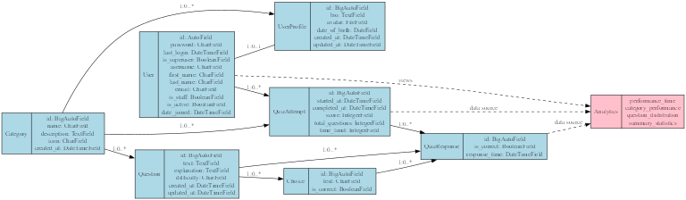

Data Models
===========

This section documents the database models used in the Quiz Game application.
These models define the structure of the data stored in the database and the
relationships between different entities.

Entity Relationship Diagram
--------------------------

The diagram above illustrates the relationships between the primary entities in the system.

Category Model
-------------

.. py:class:: Category

   Represents a topic or subject area for quizzes.
   
   Categories organize questions into logical groups, allowing users to select
   quizzes by topics that interest them.

   .. py:attribute:: name
      :type: CharField
      
      The name of the category (e.g., "Science", "History", "Sports").
      Must be unique.

   .. py:attribute:: description
      :type: TextField
      
      A detailed description of the category.
      Optional field.

   .. py:attribute:: icon
      :type: CharField
      
      CSS class for the category icon (e.g., 'fa-science', 'fa-history').
      Used for visual representation in the UI.

   .. py:attribute:: created_at
      :type: DateTimeField
      
      When the category was created.
      Automatically set when a new category is created.

   .. py:method:: question_count()
      :return: int
      
      Returns the number of questions in this category.

Question Model
-------------

.. py:class:: Question

   Represents a quiz question.
   
   Each question belongs to a category and has multiple choice answers,
   with one choice marked as correct.

   .. py:attribute:: category
      :type: ForeignKey to Category
      
      The category this question belongs to.

   .. py:attribute:: text
      :type: TextField
      
      The actual question text.

   .. py:attribute:: explanation
      :type: TextField
      
      Explanation of the correct answer, shown after answering.
      Optional field.

   .. py:attribute:: difficulty
      :type: CharField
      
      The difficulty level of the question.
      Choices: 'easy', 'medium', 'hard'.
      Default: 'medium'.

   .. py:attribute:: created_at
      :type: DateTimeField
      
      When the question was created.

   .. py:attribute:: updated_at
      :type: DateTimeField
      
      When the question was last updated.

   .. py:method:: correct_choice()
      :return: Choice or None
      
      Returns the correct choice for this question.

Choice Model
-----------

.. py:class:: Choice

   Represents a possible answer for a quiz question.
   
   Each Choice is linked to a Question, and one Choice per Question
   should be marked as correct.

   .. py:attribute:: question
      :type: ForeignKey to Question
      
      The question this choice belongs to.

   .. py:attribute:: text
      :type: CharField
      
      The text of this answer choice.

   .. py:attribute:: is_correct
      :type: BooleanField
      
      Whether this choice is the correct answer.
      Default: False.

   .. py:method:: save(*args, **kwargs)
      
      Override of the save method to ensure only one choice
      per question is marked as correct.

QuizAttempt Model
---------------

.. py:class:: QuizAttempt

   Represents a user's attempt at a quiz.
   
   Records metadata about the quiz attempt, including when it was started,
   completed, which category was selected, and the overall score.

   .. py:attribute:: user
      :type: ForeignKey to User
      
      The user who took the quiz.
      Can be null for anonymous users.

   .. py:attribute:: category
      :type: ForeignKey to Category
      
      The category of questions in this quiz.

   .. py:attribute:: started_at
      :type: DateTimeField
      
      When the quiz attempt was started.
      Default: current time.

   .. py:attribute:: completed_at
      :type: DateTimeField
      
      When the quiz attempt was completed.
      Null if the quiz is not yet complete.

   .. py:attribute:: score
      :type: IntegerField
      
      The total score achieved.
      Default: 0.

   .. py:attribute:: total_questions
      :type: IntegerField
      
      The total number of questions in the quiz.
      Default: 0.

   .. py:method:: is_complete()
      :return: bool
      
      Returns whether the quiz attempt has been completed.

   .. py:method:: calculate_score()
      :return: int
      
      Calculates and updates the score based on correct responses.

   .. py:method:: score_percentage()
      :return: float
      
      Returns the score as a percentage (0-100).

QuizResponse Model
----------------

.. py:class:: QuizResponse

   Represents a user's response to a single question within a quiz attempt.
   
   Tracks which question was asked, which choice was selected, and whether
   the answer was correct.

   .. py:attribute:: quiz_attempt
      :type: ForeignKey to QuizAttempt
      
      The quiz attempt this response belongs to.

   .. py:attribute:: question
      :type: ForeignKey to Question
      
      The question that was answered.

   .. py:attribute:: selected_choice
      :type: ForeignKey to Choice
      
      The choice that was selected by the user.

   .. py:attribute:: is_correct
      :type: BooleanField
      
      Whether this response was correct.
      Default: False.

   .. py:attribute:: response_time
      :type: DateTimeField
      
      When this question was answered.
      Auto-set when the response is created.

   .. py:method:: save(*args, **kwargs)
      
      Override of the save method to automatically set is_correct
      based on whether the selected choice is correct.

Database Schema
--------------

.. code-block:: sql

   -- Category Table
   CREATE TABLE "quiz_app_category" (
       "id" integer NOT NULL PRIMARY KEY AUTOINCREMENT,
       "name" varchar(100) NOT NULL UNIQUE,
       "description" text NOT NULL,
       "icon" varchar(50) NOT NULL,
       "created_at" datetime NOT NULL
   );
   
   -- Question Table
   CREATE TABLE "quiz_app_question" (
       "id" integer NOT NULL PRIMARY KEY AUTOINCREMENT,
       "text" text NOT NULL,
       "explanation" text NOT NULL,
       "difficulty" varchar(10) NOT NULL,
       "created_at" datetime NOT NULL,
       "updated_at" datetime NOT NULL,
       "category_id" integer NOT NULL REFERENCES "quiz_app_category" ("id") DEFERRABLE INITIALLY DEFERRED
   );
   
   -- Choice Table
   CREATE TABLE "quiz_app_choice" (
       "id" integer NOT NULL PRIMARY KEY AUTOINCREMENT,
       "text" varchar(255) NOT NULL,
       "is_correct" bool NOT NULL,
       "question_id" integer NOT NULL REFERENCES "quiz_app_question" ("id") DEFERRABLE INITIALLY DEFERRED
   );
   
   -- QuizAttempt Table
   CREATE TABLE "quiz_app_quizattempt" (
       "id" integer NOT NULL PRIMARY KEY AUTOINCREMENT,
       "started_at" datetime NOT NULL,
       "completed_at" datetime NULL,
       "score" integer NOT NULL,
       "total_questions" integer NOT NULL,
       "category_id" integer NOT NULL REFERENCES "quiz_app_category" ("id") DEFERRABLE INITIALLY DEFERRED,
       "user_id" integer NULL REFERENCES "auth_user" ("id") DEFERRABLE INITIALLY DEFERRED
   );
   
   -- QuizResponse Table
   CREATE TABLE "quiz_app_quizresponse" (
       "id" integer NOT NULL PRIMARY KEY AUTOINCREMENT,
       "is_correct" bool NOT NULL,
       "response_time" datetime NOT NULL,
       "question_id" integer NOT NULL REFERENCES "quiz_app_question" ("id") DEFERRABLE INITIALLY DEFERRED,
       "quiz_attempt_id" integer NOT NULL REFERENCES "quiz_app_quizattempt" ("id") DEFERRABLE INITIALLY DEFERRED,
       "selected_choice_id" integer NOT NULL REFERENCES "quiz_app_choice" ("id") DEFERRABLE INITIALLY DEFERRED
   );

Model Relationships
-----------------

* **One-to-Many**:
  
  * Category → Questions (one category has many questions)
  * Question → Choices (one question has multiple choices)
  * QuizAttempt → QuizResponses (one attempt has multiple responses)
  * User → QuizAttempts (one user can have multiple quiz attempts)

* **Many-to-One**:
  
  * Question → Category (many questions belong to one category)
  * Choice → Question (many choices belong to one question)
  * QuizResponse → QuizAttempt (many responses belong to one attempt)

Data Integrity Constraints
------------------------

* Each Choice must belong to exactly one Question
* Each Question must belong to exactly one Category
* Only one Choice per Question can be marked as correct
* Each QuizResponse must have exactly one selected Choice
* Each QuizAttempt-Question pair can have at most one QuizResponse 