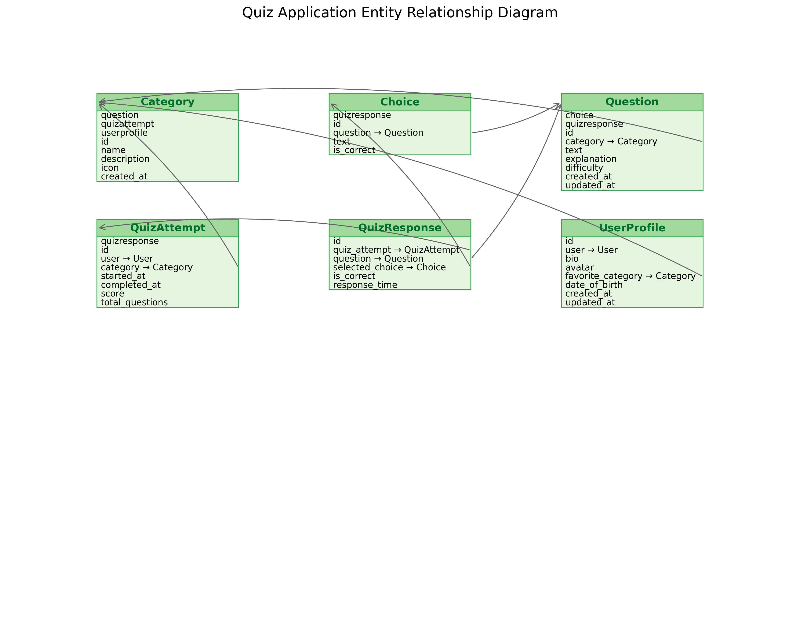

Data Models
===========

This section documents the database models used in the Quiz Game application.
These models define the structure of the data stored in the database and the
relationships between different entities.

Entity Relationship Diagram
--------------------------

The following diagram illustrates the relationships between the different models in the Quiz Game application:

.. image:: _static/erd_diagram_matplotlib.png
   :alt: Entity Relationship Diagram
   :align: center
   :width: 100%

Updated Entity Relationship Diagram
----------------------------------

Below is an improved version of the Entity Relationship Diagram showing all models and their relationships:

Entity Relationship Description
~~~~~~~~~~~~~~~~~~~~~~~~~~~~~~

* **User to UserProfile**: One-to-one relationship. Each User has exactly one UserProfile.
* **User to QuizAttempt**: One-to-many relationship. A User can have multiple QuizAttempts.
* **Category to Question**: One-to-many relationship. A Category contains multiple Questions.
* **Category to QuizAttempt**: One-to-many relationship. A Category can have multiple QuizAttempts.
* **Category to UserProfile**: One-to-many relationship. A Category can be the favorite of multiple UserProfiles.
* **Question to Choice**: One-to-many relationship. A Question has multiple Choices.
* **Question to QuizResponse**: One-to-many relationship. A Question can have multiple QuizResponses.
* **QuizAttempt to QuizResponse**: One-to-many relationship. A QuizAttempt contains multiple QuizResponses.
* **Choice to QuizResponse**: One-to-many relationship. A Choice can be selected in multiple QuizResponses.

For a detailed description of each model and its fields, see the model documentation above. For a full database schema, see below.

Database Schema
--------------

.. code-block:: sql

   -- Category Table
   CREATE TABLE "quiz_app_category" (
       "id" integer NOT NULL PRIMARY KEY AUTOINCREMENT,
       "name" varchar(100) NOT NULL UNIQUE,
       "description" text NOT NULL,
       "icon" varchar(50) NOT NULL,
       "created_at" datetime NOT NULL
   );
   
   -- Question Table
   CREATE TABLE "quiz_app_question" (
       "id" integer NOT NULL PRIMARY KEY AUTOINCREMENT,
       "text" text NOT NULL,
       "explanation" text NOT NULL,
       "difficulty" varchar(10) NOT NULL,
       "created_at" datetime NOT NULL,
       "updated_at" datetime NOT NULL,
       "category_id" integer NOT NULL REFERENCES "quiz_app_category" ("id") DEFERRABLE INITIALLY DEFERRED
   );
   
   -- Choice Table
   CREATE TABLE "quiz_app_choice" (
       "id" integer NOT NULL PRIMARY KEY AUTOINCREMENT,
       "text" varchar(255) NOT NULL,
       "is_correct" bool NOT NULL,
       "question_id" integer NOT NULL REFERENCES "quiz_app_question" ("id") DEFERRABLE INITIALLY DEFERRED
   );
   
   -- QuizAttempt Table
   CREATE TABLE "quiz_app_quizattempt" (
       "id" integer NOT NULL PRIMARY KEY AUTOINCREMENT,
       "started_at" datetime NOT NULL,
       "completed_at" datetime NULL,
       "score" integer NOT NULL,
       "total_questions" integer NOT NULL,
       "category_id" integer NOT NULL REFERENCES "quiz_app_category" ("id") DEFERRABLE INITIALLY DEFERRED,
       "user_id" integer NULL REFERENCES "auth_user" ("id") DEFERRABLE INITIALLY DEFERRED
   );
   
   -- QuizResponse Table
   CREATE TABLE "quiz_app_quizresponse" (
       "id" integer NOT NULL PRIMARY KEY AUTOINCREMENT,
       "is_correct" bool NOT NULL,
       "response_time" datetime NOT NULL,
       "question_id" integer NOT NULL REFERENCES "quiz_app_question" ("id") DEFERRABLE INITIALLY DEFERRED,
       "quiz_attempt_id" integer NOT NULL REFERENCES "quiz_app_quizattempt" ("id") DEFERRABLE INITIALLY DEFERRED,
       "selected_choice_id" integer NOT NULL REFERENCES "quiz_app_choice" ("id") DEFERRABLE INITIALLY DEFERRED
   );

Model Relationships
-----------------

* **One-to-Many**:
  
  * Category → Questions (one category has many questions)
  * Question → Choices (one question has multiple choices)
  * QuizAttempt → QuizResponses (one attempt has multiple responses)
  * User → QuizAttempts (one user can have multiple quiz attempts)

* **Many-to-One**:
  
  * Question → Category (many questions belong to one category)
  * Choice → Question (many choices belong to one question)
  * QuizResponse → QuizAttempt (many responses belong to one attempt)

Data Integrity Constraints
------------------------

* Each Choice must belong to exactly one Question
* Each Question must belong to exactly one Category
* Only one Choice per Question can be marked as correct
* Each QuizResponse must have exactly one selected Choice
* Each QuizAttempt-Question pair can have at most one QuizResponse 