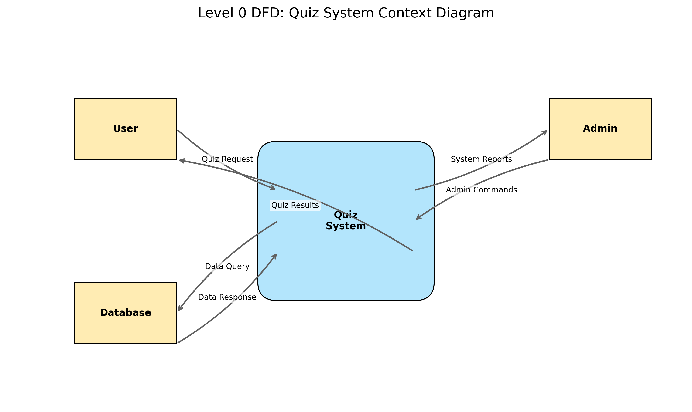
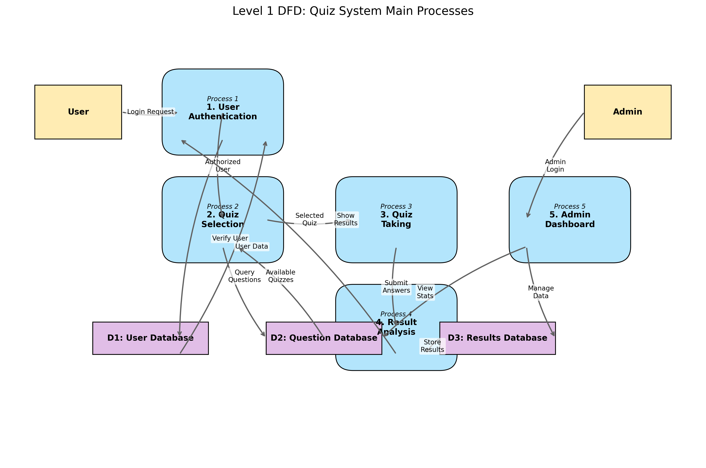
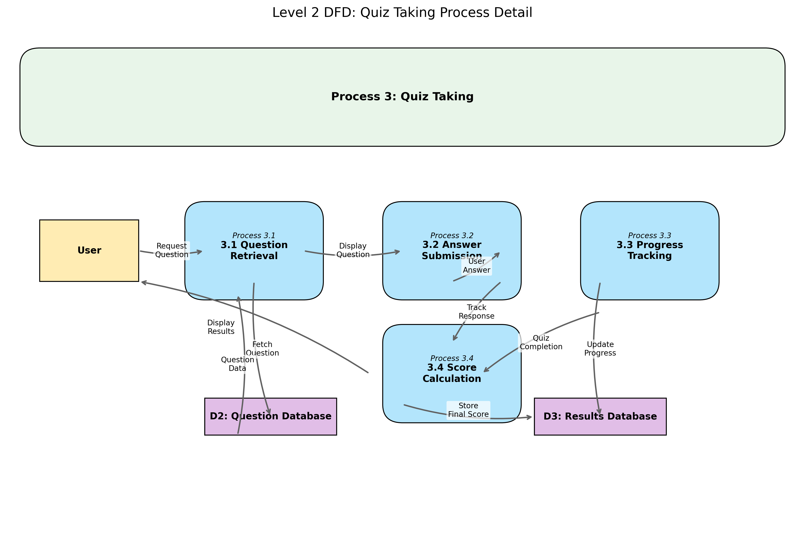
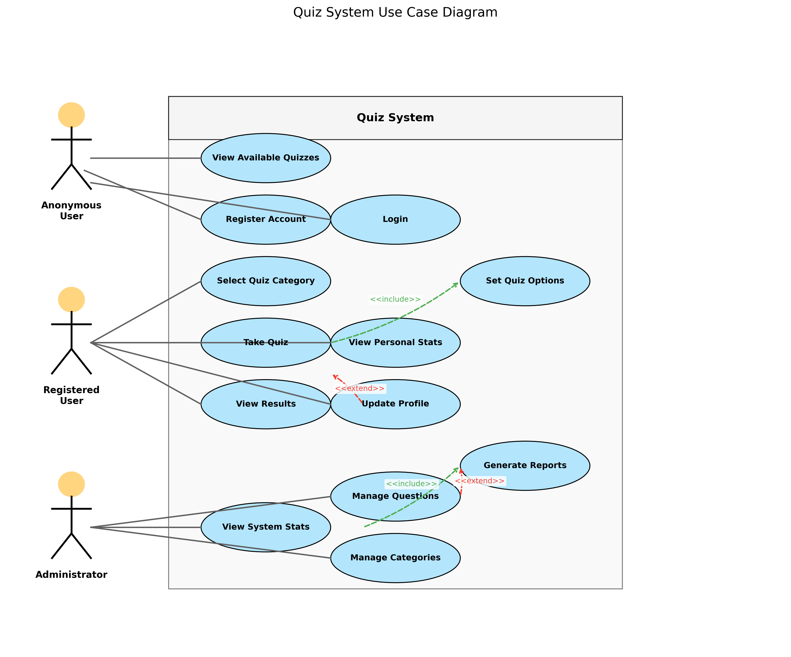
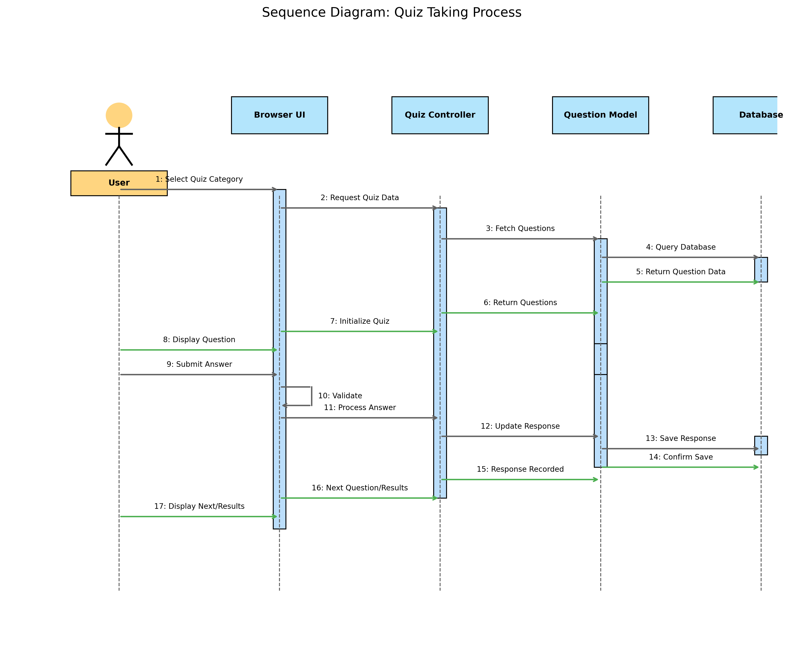
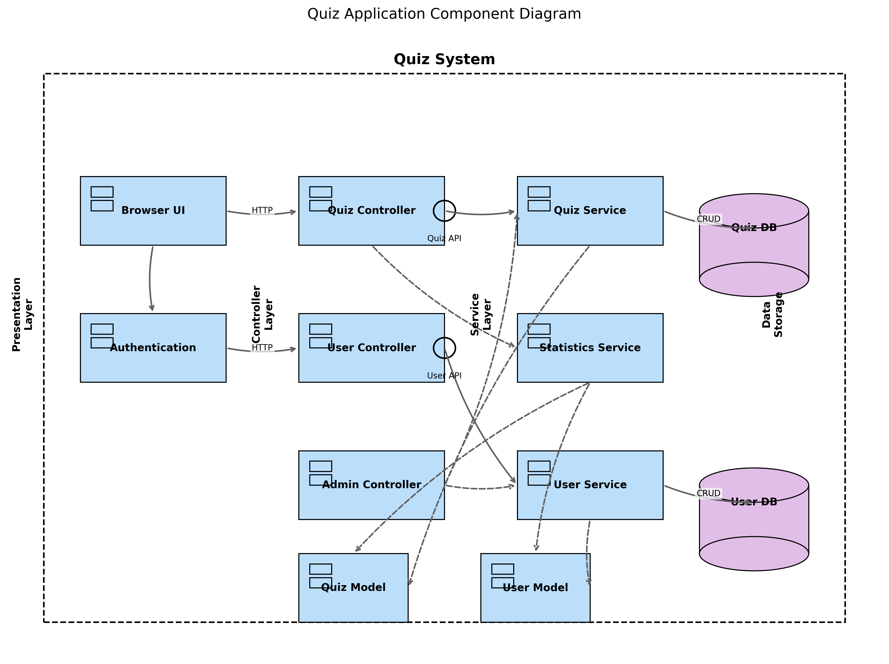
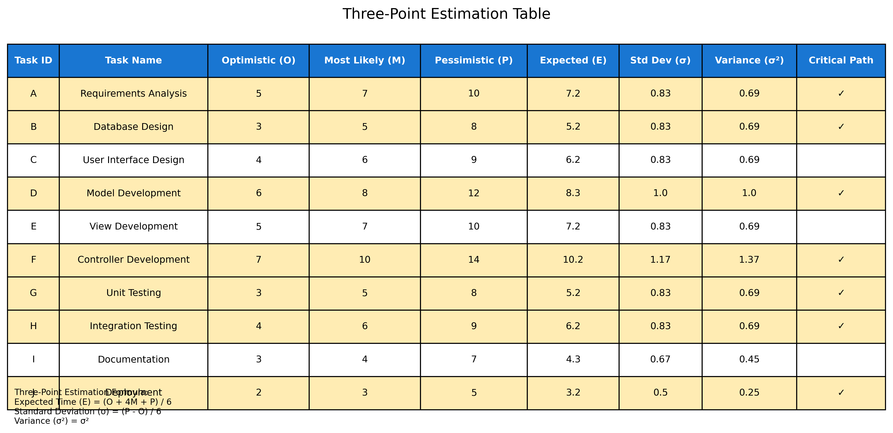
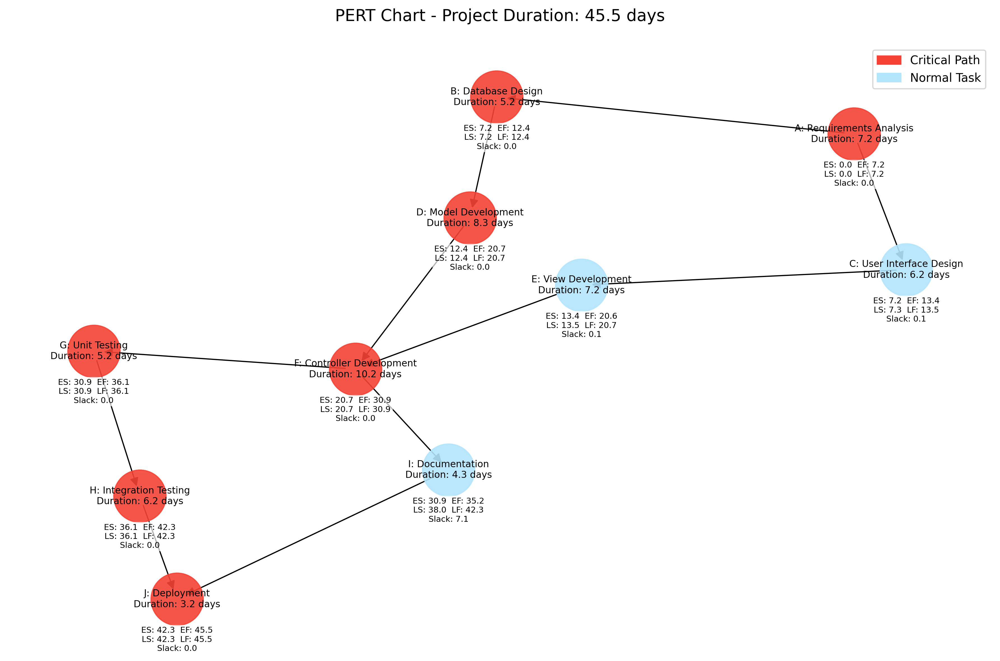
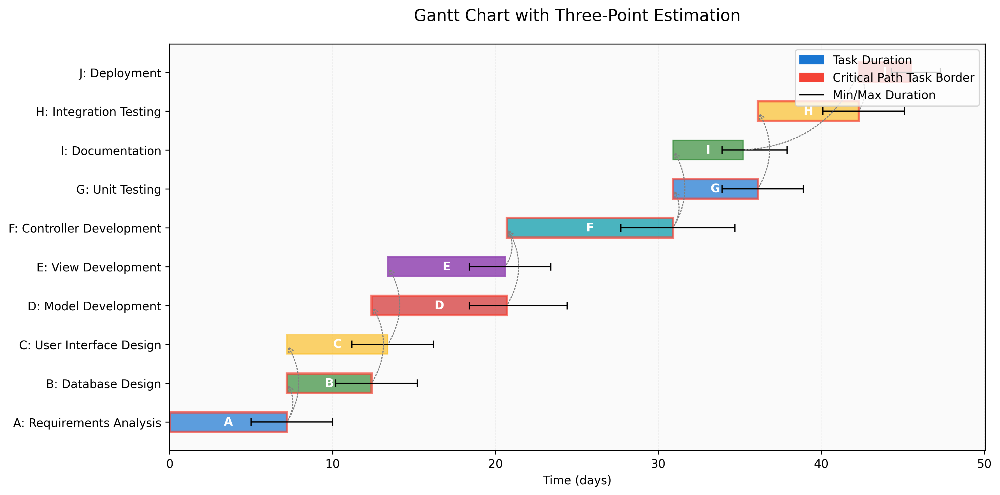

# Quiz Application - Project Diagrams

This document provides an overview of the various diagrams created for the Quiz Application project. These diagrams help visualize different aspects of the system design, architecture, and project planning.

## Table of Contents
- [Data Flow Diagrams](#data-flow-diagrams)
- [Use Case Diagram](#use-case-diagram)
- [Sequence Diagram](#sequence-diagram)
- [Component Diagram](#component-diagram)
- [Project Planning](#project-planning)
  - [Three-Point Estimation](#three-point-estimation)
  - [PERT Chart](#pert-chart)
  - [Gantt Chart](#gantt-chart)

## Data Flow Diagrams

Data Flow Diagrams (DFDs) illustrate how data moves through the Quiz application. We provide three levels of DFDs to show increasing levels of detail.

### Level 0 DFD (Context Diagram)

The context diagram shows the system as a single process interacting with external entities.



**Key Elements:**
- The Quiz System is represented as a single process
- External entities include Users, Administrators, and the Database
- Data flows show the high-level interactions between entities

### Level 1 DFD

The Level 1 DFD breaks down the system into its major processes and data stores.



**Key Elements:**
- Major processes: User Authentication, Quiz Selection, Quiz Taking, Result Analysis, Admin Dashboard
- Data stores: User Database, Question Database, Results Database
- Data flows showing how information moves between processes and data stores

### Level 2 DFD (Quiz Taking Process)

The Level 2 DFD provides a detailed view of the Quiz Taking process.



**Key Elements:**
- Detailed sub-processes: Question Retrieval, Answer Submission, Progress Tracking, Score Calculation
- Data stores accessed during quiz taking
- Detailed data flows showing the complete quiz-taking workflow

## Use Case Diagram

The Use Case Diagram illustrates the interactions between users and the system functionality.



**Key Elements:**
- Actor types: Anonymous User, Registered User, and Administrator
- Primary use cases for each actor type
- Include and extend relationships between use cases
- System boundary defining the scope of the application

## Sequence Diagram

The Sequence Diagram shows the time-ordered interactions for the quiz-taking process.



**Key Elements:**
- Participants: User, Browser UI, Quiz Controller, Question Model, Database
- Message sequence showing the complete quiz-taking flow
- Return messages indicating responses between components
- Activation bars showing when each component is active

## Component Diagram

The Component Diagram illustrates the high-level architecture of the application.



**Key Elements:**
- Architectural layers: Presentation, Controller, Service, and Data Storage
- Components within each layer
- Interfaces provided by components
- Dependencies between components
- Database connections

## Project Planning

The project planning diagrams provide insights into the project schedule, task dependencies, and time estimation.

### Three-Point Estimation

The Three-Point Estimation table shows optimistic, most likely, and pessimistic time estimates for each project task.



**Key Elements:**
- Task breakdown with IDs
- Three-point estimates (Optimistic, Most Likely, Pessimistic)
- Expected duration calculation
- Standard deviation and variance values
- Critical path identification

### PERT Chart

The PERT (Program Evaluation and Review Technique) chart shows task dependencies and the critical path.



**Key Elements:**
- Nodes representing project tasks
- Edges showing dependencies between tasks
- Critical path highlighted in red
- Early start/finish and late start/finish times for each task
- Slack time calculation

### Gantt Chart

The Gantt chart provides a timeline view of the project schedule.



**Key Elements:**
- Horizontal bars representing task durations
- Task dependencies shown as arrows
- Critical path tasks highlighted
- Three-point estimation uncertainty ranges
- Timeline with day markers

## Generating the Diagrams

All diagrams were generated programmatically using Python with the following libraries:
- Matplotlib
- NetworkX
- NumPy
- Pandas

The code for generating these diagrams is available in the `docs/diagrams/` directory. To regenerate all diagrams, run:

```bash
python docs/diagrams/generate_all_diagrams.py
```

## Conclusion

These diagrams provide a comprehensive visual representation of the Quiz Application's design, architecture, and project plan. They serve as valuable documentation for developers, stakeholders, and future maintenance teams. 