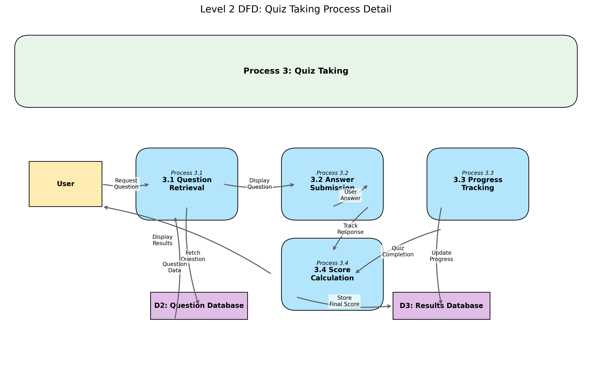
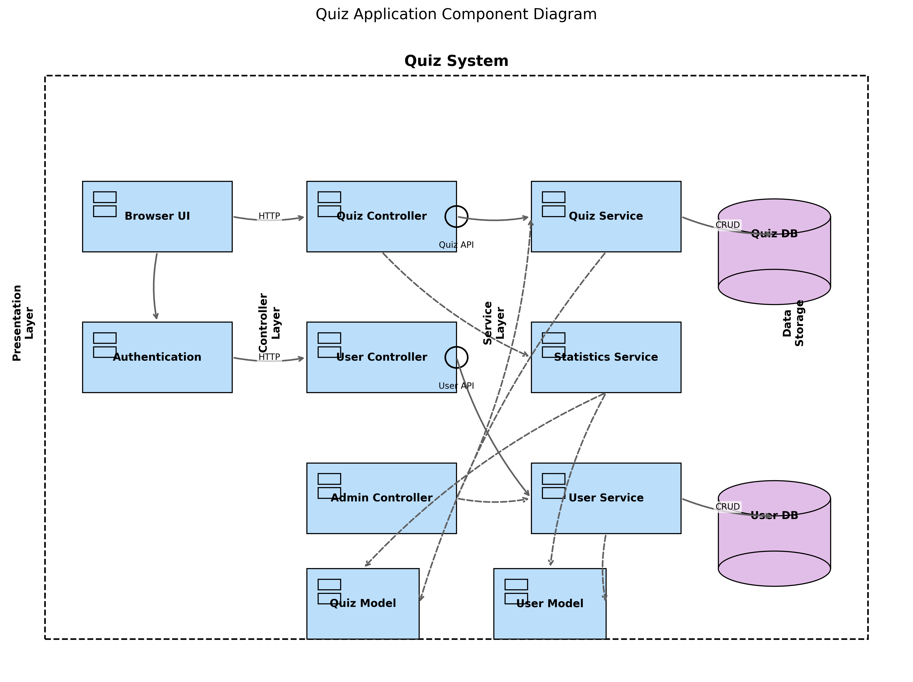

Project Diagrams
================

Last updated: 2025-05-08

Quiz Application - Project Diagrams

===================================

This document provides an overview of the various diagrams created for

the Quiz Application project. These diagrams help visualize different

aspects of the system design, architecture, and project planning.

Table of Contents

-----------------

- `Data Flow Diagrams <#data-flow-diagrams>`__

- `Use Case Diagram <#use-case-diagram>`__

- `Sequence Diagram <#sequence-diagram>`__

- `Component Diagram <#component-diagram>`__

- `Project Planning <#project-planning>`__

  - `Three-Point Estimation <#three-point-estimation>`__

  - `PERT Chart <#pert-chart>`__

  - `Gantt Chart <#gantt-chart>`__

Data Flow Diagrams

------------------

Data Flow Diagrams (DFDs) illustrate how data moves through the Quiz

application. We provide three levels of DFDs to show increasing levels

of detail.

Level 0 DFD (Context Diagram)

~~~~~~~~~~~~~~~~~~~~~~~~~~~~~

The context diagram shows the system as a single process interacting

with external entities.

   :alt: Level 0 DFD

   Level 0 DFD

**Key Elements:** - The Quiz System is represented as a single process -

External entities include Users, Administrators, and the Database - Data

flows show the high-level interactions between entities

Level 1 DFD

~~~~~~~~~~~

The Level 1 DFD breaks down the system into its major processes and data

stores.

   :alt: Level 1 DFD

   Level 1 DFD

**Key Elements:** - Major processes: User Authentication, Quiz

Selection, Quiz Taking, Result Analysis, Admin Dashboard - Data stores:

User Database, Question Database, Results Database - Data flows showing

how information moves between processes and data stores

Level 2 DFD (Quiz Taking Process)

~~~~~~~~~~~~~~~~~~~~~~~~~~~~~~~~~

The Level 2 DFD provides a detailed view of the Quiz Taking process.

   :alt: Level 2 DFD

   Level 2 DFD

**Key Elements:** - Detailed sub-processes: Question Retrieval, Answer

Submission, Progress Tracking, Score Calculation - Data stores accessed

during quiz taking - Detailed data flows showing the complete

quiz-taking workflow

Use Case Diagram

----------------

The Use Case Diagram illustrates the interactions between users and the

system functionality.

   :alt: Use Case Diagram

   Use Case Diagram

**Key Elements:** - Actor types: Anonymous User, Registered User, and

Administrator - Primary use cases for each actor type - Include and

extend relationships between use cases - System boundary defining the

scope of the application

Sequence Diagram

----------------

The Sequence Diagram shows the time-ordered interactions for the

quiz-taking process.

   :alt: Sequence Diagram

   Sequence Diagram

**Key Elements:** - Participants: User, Browser UI, Quiz Controller,

Question Model, Database - Message sequence showing the complete

quiz-taking flow - Return messages indicating responses between

components - Activation bars showing when each component is active

Component Diagram

-----------------

The Component Diagram illustrates the high-level architecture of the

application.

   :alt: Component Diagram

   Component Diagram

**Key Elements:** - Architectural layers: Presentation, Controller,

Service, and Data Storage - Components within each layer - Interfaces

provided by components - Dependencies between components - Database

connections

Project Planning

----------------

The project planning diagrams provide insights into the project

schedule, task dependencies, and time estimation.

Three-Point Estimation

~~~~~~~~~~~~~~~~~~~~~~

The Three-Point Estimation table shows optimistic, most likely, and

pessimistic time estimates for each project task.

.. figure:: diagrams/output/three_point_estimation.png

   :alt: Three-Point Estimation

   Three-Point Estimation

**Key Elements:** - Task breakdown with IDs - Three-point estimates

(Optimistic, Most Likely, Pessimistic) - Expected duration calculation -

Standard deviation and variance values - Critical path identification

PERT Chart

~~~~~~~~~~

The PERT (Program Evaluation and Review Technique) chart shows task

dependencies and the critical path.

   :alt: PERT Chart

   PERT Chart

**Key Elements:** - Nodes representing project tasks - Edges showing

dependencies between tasks - Critical path highlighted in red - Early

start/finish and late start/finish times for each task - Slack time

calculation

Gantt Chart

~~~~~~~~~~~

The Gantt chart provides a timeline view of the project schedule.

.. figure:: diagrams/output/gantt_chart.png

   :alt: Gantt Chart

   Gantt Chart

**Key Elements:** - Horizontal bars representing task durations - Task

dependencies shown as arrows - Critical path tasks highlighted -

Three-point estimation uncertainty ranges - Timeline with day markers

Understanding the Diagrams
-------------------------

Data Flow Diagrams (DFD)
~~~~~~~~~~~~~~~~~~~~~~~

Data Flow Diagrams visualize how information moves through the Quiz Application system. By mapping data flows between external entities, processes, and data stores, DFDs help identify system boundaries and information exchange patterns. Our multi-level approach progressively reveals more detailed interactions, from the high-level context (Level 0) to detailed sub-processes (Level 2).

Use Case Diagram
~~~~~~~~~~~~~~~

The Use Case Diagram illustrates user interactions with the system from a functional perspective. By depicting various actors (user types) and their relationships with system functions, this diagram clarifies user requirements and system capabilities. The diagram helps stakeholders understand what the system does from an external viewpoint without concerning implementation details.

Sequence Diagram
~~~~~~~~~~~~~~~

Sequence Diagrams show time-ordered interactions between objects in the Quiz Application. By visualizing the message exchange sequence between components, these diagrams demonstrate the dynamic behavior and collaboration patterns within the system. The lifelines and activation bars illustrate when components are active during specific operations.

Component Diagram
~~~~~~~~~~~~~~~~

The Component Diagram provides a high-level architectural view of the Quiz Application. By showing the organization and dependencies between major software components, this diagram helps developers understand system structure. The interfaces between components represent the contracts that enable different parts of the application to work together cohesively.

Project Planning Diagrams
~~~~~~~~~~~~~~~~~~~~~~~~

Project planning diagrams (Three-Point Estimation, PERT Chart, and Gantt Chart) visualize the project timeline, task dependencies, and resource allocation. Using three-point estimation, these diagrams account for uncertainty in task durations. The critical path highlights the sequence of tasks that determine the project's minimum completion time, helping project managers allocate resources efficiently.

Generating the Diagrams
-----------------------

All diagrams were generated programmatically using Python with the

following libraries: - Matplotlib - NetworkX - NumPy - Pandas

The code for generating these diagrams is available in the

``docs/diagrams/`` directory. To regenerate all diagrams, run:

.. code:: bash

   python docs/diagrams/generate_all_diagrams.py

Conclusion

----------

These diagrams provide a comprehensive visual representation of the Quiz

Application's design, architecture, and project plan. They serve as

valuable documentation for developers, stakeholders, and future

maintenance teams.

''
