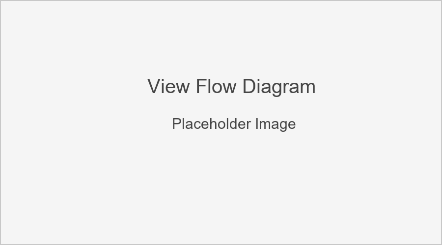

Views
=====

This section documents the view functions and classes in the Quiz Game application.
Views handle the HTTP requests, perform business logic, and return appropriate responses.

View Flow Diagram
----------------

The diagram above illustrates the flow between different views in the application.

Index View
---------

.. py:class:: IndexView

   View for the home page of the quiz application.
   
   This class-based view displays a welcome message and available quiz categories.
   It inherits from Django's TemplateView.

   .. py:attribute:: template_name
      :type: str
      
      Path to the template used for rendering: 'quiz_app/index.html'

   .. py:method:: get_context_data(**kwargs)
      :return: dict
      
      Adds categories and the quiz selection form to the template context.
      
      * Gets all categories with their question counts
      * Filters out categories with no questions
      * Creates a QuizSelectionForm instance
      
      **Returns**: Context dictionary with 'categories' and 'form' keys

Category List View
----------------

.. py:class:: CategoryListView

   View to display all available quiz categories.
   
   This class-based view inherits from Django's ListView and displays
   a list of all categories that have at least one question.

   .. py:attribute:: model
      :type: Model
      
      The model to list: Category

   .. py:attribute:: template_name
      :type: str
      
      Path to the template: 'quiz_app/category_list.html'

   .. py:attribute:: context_object_name
      :type: str
      
      Name of the context variable: 'categories'

   .. py:method:: get_queryset()
      :return: QuerySet
      
      Returns only categories that have at least one question.
      
      Uses Django's annotation and filtering to count questions per category
      and exclude categories with zero questions.

Quiz Start View
-------------

.. py:class:: QuizStartView

   View to handle the start of a new quiz.
   
   This class-based view creates a new QuizAttempt and redirects to the first question.
   It handles the form submission from the quiz selection page.

   .. py:method:: post(request)
      :param request: HttpRequest
      :return: HttpResponse
      
      Handles POST request with category selection.
      
      **Process**:
      
      1. Validates the quiz selection form
      2. Gets the selected category and number of questions
      3. Creates a new QuizAttempt
      4. Selects random questions from the category
      5. Stores question IDs in the session
      6. Redirects to the first question

Question View
-----------

.. py:class:: QuestionView

   View to display a quiz question and process the answer.
   
   This class-based view handles both displaying questions and processing answers.

   .. py:attribute:: template_name
      :type: str
      
      Path to the template: 'quiz_app/question.html'

   .. py:method:: get(request)
      :param request: HttpRequest
      :return: HttpResponse
      
      Handles GET request to display a question.
      
      **Process**:
      
      1. Checks if there's an active quiz in the session
      2. Gets the current question index and quiz attempt
      3. Checks if we've reached the end of the quiz
         * If yes, completes the quiz and redirects to results
         * If no, displays the current question
      4. Prepares context with question, choices, and progress info
      
      **Context Provided**:
      
      * quiz_attempt: The current QuizAttempt instance
      * question: The current Question instance
      * choices: Available choices for the question
      * question_number: Current question number (1-based)
      * total_questions: Total number of questions in the quiz
      * progress_percentage: Progress as a percentage

   .. py:method:: post(request)
      :param request: HttpRequest
      :return: HttpResponse
      
      Handles POST request with answer submission.
      
      **Process**:
      
      1. Checks if there's an active quiz
      2. Gets the current question and quiz attempt
      3. Processes the submitted answer
      4. Records the response
      5. Moves to the next question
      6. Redirects back to the question view

Results View
----------

.. py:class:: ResultsView

   View to display the results of a completed quiz.
   
   This class-based view inherits from Django's DetailView and shows
   the score, performance charts, and answer review for a completed quiz.

   .. py:attribute:: model
      :type: Model
      
      The model to display: QuizAttempt

   .. py:attribute:: template_name
      :type: str
      
      Path to the template: 'quiz_app/results.html'

   .. py:attribute:: context_object_name
      :type: str
      
      Name of the context variable: 'quiz_attempt'

   .. py:attribute:: pk_url_kwarg
      :type: str
      
      Name of the URL keyword argument: 'quiz_id'

   .. py:method:: get_context_data(**kwargs)
      :return: dict
      
      Adds extra context data including visualizations.
      
      **Process**:
      
      1. Gets all responses for this attempt
      2. Creates a pandas DataFrame for analysis
      3. Generates performance by difficulty chart
      4. Encodes the chart as a base64 string
      5. Adds chart and responses to the context
      
      **Context Provided**:
      
      * performance_chart: Base64-encoded image of difficulty performance chart
      * responses: QuizResponse objects for this attempt

User Stats View
-------------

.. py:class:: UserStatsView

   View to display statistics and analytics for a user's quiz history.
   
   This class-based view requires authentication and shows visualizations
   of the user's performance across different categories and over time.

   .. py:attribute:: template_name
      :type: str
      
      Path to the template: 'quiz_app/user_stats.html'

   .. py:method:: get_context_data(**kwargs)
      :return: dict
      
      Adds user statistics to the context.
      
      **Process**:
      
      1. Gets all completed quiz attempts by this user
      2. Creates a pandas DataFrame for analysis
      3. Generates charts:
         * Performance over time line chart
         * Performance by category bar chart
      4. Calculates summary statistics
      
      **Context Provided**:
      
      * time_chart: Performance over time visualization
      * category_chart: Performance by category visualization
      * total_quizzes: Number of quizzes completed
      * avg_score: Average score percentage
      * categories_attempted: Number of unique categories attempted
      * best_category: Category with highest average score

URL Patterns
-----------

The application defines the following URL patterns:

.. code-block:: python

   app_name = 'quiz'  # Application namespace
   
   urlpatterns = [
       # Home page / index view
       path('', views.IndexView.as_view(), name='index'),
       
       # List of quiz categories
       path('categories/', views.CategoryListView.as_view(), name='categories'),
       
       # Start a new quiz
       path('start/', views.QuizStartView.as_view(), name='start'),
       
       # Answer quiz questions
       path('question/', views.QuestionView.as_view(), name='question'),
       
       # View quiz results
       path('results/<int:quiz_id>/', views.ResultsView.as_view(), name='results'),
       
       # User statistics dashboard
       path('stats/', views.UserStatsView.as_view(), name='user_stats'),
   ]

Session Management
----------------

The application uses Django's session framework to maintain quiz state:

* **quiz_questions**: List of question IDs for the current quiz
* **current_question_index**: Index of the current question (0-based)
* **quiz_attempt_id**: ID of the current QuizAttempt

These session keys are set when a quiz starts and cleared when it completes.

Data Visualization
----------------

The views utilize pandas, matplotlib, and seaborn for data analysis and visualization:

1. Data is retrieved from the database and converted to pandas DataFrames
2. Analysis is performed (grouping, aggregation, statistics)
3. Visualizations are created with matplotlib/seaborn
4. Images are converted to base64-encoded strings for embedding in HTML

This approach allows for rich data visualization without requiring JavaScript
charting libraries on the frontend. 